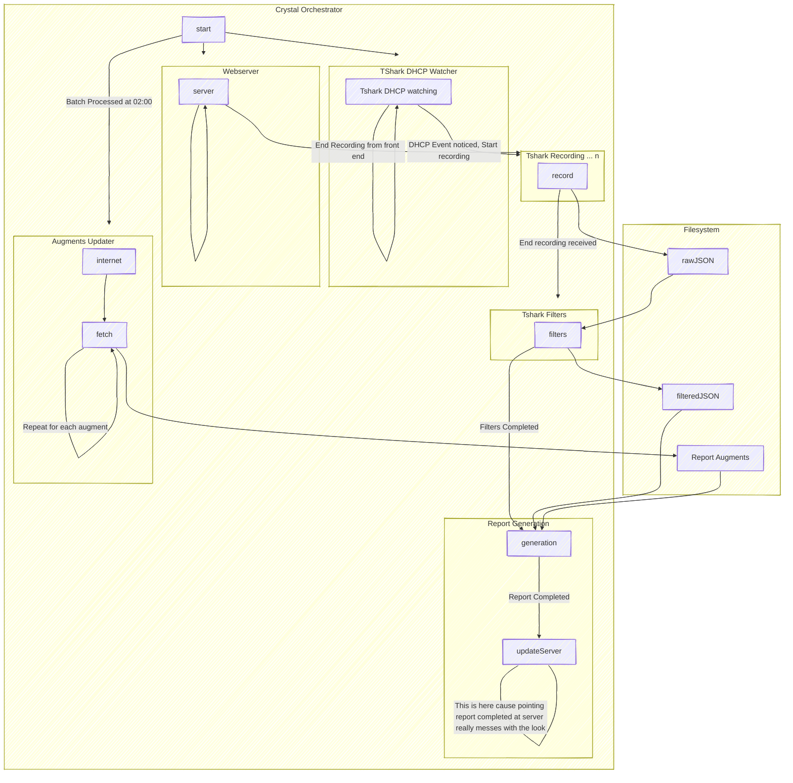

# Disclaimer

This specification document is in its very early stages. It is being used to document the expectations of hardware and software as is understood and will be updated as those change. 

Please see Andrew K regarding inacuracies or updates to be made as this document is intended to have a singular author. 

# Overview

This project is for creating a hardware and software setup for being able to connect a network device and get a report of all the locations that it visited during the time frame it was being monitored.

Within this report there will be information such as what ports does the device have open. What IP addresses did it reach out to. If it performed actions that we are unsure of. As well as general advice for things like UBlock Origin or Domain Name Server (DNS) Blocking.

The setup will have WiFi and Ethernet connectivity to allow for things like Power Over Ethernet (POE) Internet of Things (IOT) devices, IOT lightbulbs, digital photo frames, smart Televisions (TVs), and full computers. 

To get the most data possible, we are attempting to automatically start packet capture of the device on dhcp negotiation. 

## Hardware

## Software

# Non Goals

- Works on WindowsOS

## V1
- Multiple Devices
- Preferred Network Offload (PNO) report
- IPV6
- Deep packet Inspection
- Self contained in a 10in rack for "portability"
- dhcp only tshark record trigger

# Scenarios

# Open Issues

## Hardware
- [x] Wireless Access Point (WAP) or Medium Access Control (MAC) Address rolling?
  - [ ] or hidden Service Set Identifier (SSID)?
  - [ ] or WAP connection limit?
  - [ ] or Forget on Disconnect?
  - **Decision**: Roll WAP SSID with dates
- [x] Internet Protocol Version 4 (IPV4) only?
  - **Decision**: Both, IPV4 and IPV6
- [ ] Multiple TShark on mirror?
- [ ] TPLink no GUI WAP config?
  - [ ] Run burp and record the process then replay?

## Software
- [x] Figure out if Crystal can shell out long running commands
  - Looks like Fibers and Channels may be needed here.
  - **Decision**: Crystal seems to be able to.
  - [ ] figure out gets command to make tshark dhcp only alerting command
- [ ] How to classify network traffic
- [x] What tshark commands do we need?
  - **Decision**: Derek found some [here](tshark_test_commands.md)
  - More may be necessary
- [x] Port scan connected device?
  - **Decision**: Yes
- [x] Timed recording?
  - [ ] 15 minutes?
  - [ ] 45 minutes?
  - [ ] 300 minutes?
  - **Decision**: Not timed, stop button on User Interface (UI)
- [ ] Webhook on new device?
- [ ] Preferred Network Offload (PNO) report?
- [ ] What to include in the report?
  - [ ] Autonomous System Number (ASN)?
    - [ ] https://github.com/ipverse/asn-ip for data?
  - [ ] Blocked by DNS Blocking?
    - [ ] Steven Black https://github.com/StevenBlack/hosts
    - [ ] https://rodneylab.com/firewall-block-lists-compared/
  - [ ] Shodan Info for connected IPs?
    - Provides some level of free to educational institutions
  - [ ] Data flow?
    - Amount of data to that IP or destination
  - [ ] Geo IP?
    - [ ] https://www.maxmind.com/en/geoip-api-web-services for data?
  - [ ] Port map?
    - [ ] https://packetlife.net/library/cheat-sheets/ info from here? (Site is down currently)
      - Internet Archive (IA) Version: https://web.archive.org/web/20231226215420/https://packetlife.net
      - IA based cheatsheets added [here](Cheat%20Sheets%20-%20PacketLife.net/BGP.pdf)
  - [ ] Greynoise?
  - [ ] https://apackets.com/ breakdown?
  - [ ] Data cost of the device?
  - [ ] Deep Packet Inspection?
    - [ ] Man In The Middle (MITM) proxy or squid proxy?
    - [ ] proxy that internally has all DNS point to itself 
    - [ ] forward everything to the internet so that we can 
    - [ ] see what data it is actually sending
# Side notes